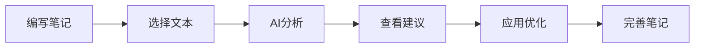

# 卡码笔记 AI 微服务架构设计

## 📋 项目概述

本项目在原有的卡码笔记基础上，集成了智谱GLM-4-Air大模型，提供了完整的AI助手功能，包括智能对话、笔记分析、内容优化等能力。

## 🏗️ 架构设计

### 当前架构（单体应用 + AI增强）
```
├── backend/                    # Spring Boot 后端
│   ├── controller/
│   │   └── AIController        # AI功能API控制器
│   ├── service/
│   │   └── ai/                 # AI服务层
│   │       ├── AIService       # AI业务逻辑
│   │       └── ZhipuAIClient   # 智谱AI客户端
│   ├── model/
│   │   └── ai/                 # AI相关数据模型
│   └── config/
│       └── ZhipuAIConfig       # AI配置类
└── frontend/                   # React 前端
    ├── services/
    │   └── aiService.ts        # AI服务接口
    ├── components/
    │   └── ai/                 # AI组件
    │       ├── AIAssistant     # AI助手组件
    │       └── SmartNoteEditor # 智能编辑器
    └── pages/
        └── AITestPage          # AI功能测试页面
```

### 未来微服务架构规划
```
┌─────────────────────────────────────────────────────────────┐
│                        API Gateway                         │
│                    (Spring Cloud Gateway)                  │
└─────────────────────┬───────────────────────────────────────┘
                      │
    ┌─────────────────┼─────────────────┐
    │                 │                 │
┌───▼────┐    ┌──────▼──────┐    ┌────▼─────┐
│ User   │    │    Note     │    │    AI    │
│Service │    │   Service   │    │ Service  │
└────────┘    └─────────────┘    └──────────┘
    │               │                  │
    │               │                  │
┌───▼────┐    ┌──────▼──────┐    ┌────▼─────┐
│ MySQL  │    │    MySQL    │    │  Redis   │
│   DB   │    │     DB      │    │  Cache   │
└────────┘    └─────────────┘    └──────────┘
```

## 🤖 AI服务详细设计

### AI服务能力矩阵

| 功能模块 | API 端点 | 功能描述 | 智谱模型调用 |
|---------|----------|----------|-------------|
| 智能对话 | `/api/ai/chat` | 多轮对话，技术问答 | ✅ |
| 笔记摘要 | `/api/ai/summarize` | 生成内容摘要 | ✅ |
| 分类建议 | `/api/ai/suggest-categories` | 智能分类推荐 | ✅ |
| 标签建议 | `/api/ai/suggest-tags` | 标签智能推荐 | ✅ |
| 代码解释 | `/api/ai/explain-code` | 代码功能解释 | ✅ |
| 内容优化 | `/api/ai/optimize` | 内容结构优化 | ✅ |
| 大纲生成 | `/api/ai/generate-outline` | 生成内容大纲 | ✅ |

### AI服务技术栈

**后端技术**
- Spring Boot 3.4.3
- 智谱GLM-4-Air API
- OkHttp3 (HTTP客户端)
- Jackson (JSON处理)
- Redis (会话存储)

**前端技术**
- React 18 + TypeScript
- Ant Design 5.x
- Axios (API调用)
- 实时对话界面

## 🔧 核心组件详解

### 1. ZhipuAIClient (智谱AI客户端)

```java
@Service
public class ZhipuAIClient {
    // 核心功能
    - chat(message, context) // 对话接口
    - generateSummary(content) // 摘要生成
    - suggestCategories(content) // 分类建议
    - explainCode(code, language) // 代码解释
    
    // 配置参数
    - API Key: f22b521f28ee4627be95303bf3e07b8c.LELtlyWKBWcFYRXe
    - Base URL: https://open.bigmodel.cn/api/paas/v4
    - Model: glm-4-air
    - Temperature: 0.7 (创造性参数)
    - Max Tokens: 1000
}
```

### 2. AIService (AI业务逻辑层)

```java
@Service
public class AIService {
    // 高级功能封装
    - chat(ChatRequest) // 支持会话管理的对话
    - analyzeNote(NoteAnalysisRequest) // 笔记分析统一入口
    - detectCodeLanguage(content) // 代码语言检测
    - sessionStore // 会话存储（内存/Redis）
}
```

### 3. 前端AI组件

**AIAssistant (AI助手)**
- 实时对话界面
- 快捷操作按钮
- 会话历史管理
- 上下文保持

**SmartNoteEditor (智能编辑器)**
- 文本选择分析
- AI分析结果展示
- 一键应用建议
- 标签智能推荐

## 📡 API接口规范

### 聊天接口
```http
POST /api/ai/chat
Content-Type: application/json

{
  "message": "请解释什么是微服务架构",
  "sessionId": "uuid-session-id",
  "modelParams": {
    "temperature": 0.7,
    "maxTokens": 1000
  }
}
```

### 笔记分析接口
```http
POST /api/ai/analyze-note
Content-Type: application/json

{
  "content": "# Spring Boot微服务\n这是关于Spring Boot的笔记...",
  "analysisType": "SUMMARY",
  "userId": 123,
  "noteId": 456
}
```

## 🚀 部署与运行

### 开发环境启动

1. **后端启动**
```bash
cd backend
mvn spring-boot:run
```

2. **前端启动**
```bash
cd frontend
npm install
npm run dev
```

3. **访问AI测试页面**
```
http://localhost:3000/ai-test
```

### 环境配置

**application.yml**
```yaml
zhipu:
  ai:
    api-key: f22b521f28ee4627be95303bf3e07b8c.LELtlyWKBWcFYRXe
    base-url: https://open.bigmodel.cn/api/paas/v4
    default-model: glm-4-air
    default-temperature: 0.7
    default-max-tokens: 1000
```

## 🎯 AI功能演示

### 1. 智能对话
- **技术问答**: "什么是微服务架构？"
- **代码咨询**: "如何优化Spring Boot启动速度？"
- **学习指导**: "学习Java需要掌握哪些知识点？"

### 2. 笔记智能分析
- **摘要生成**: 自动提取核心要点
- **标签推荐**: 基于内容推荐相关标签
- **内容优化**: 改善文章结构和表达
- **代码解释**: 详细解释代码功能

### 3. 智能工作流


## 📊 性能与监控

### 关键指标
- AI响应时间: < 5秒
- 并发支持: 100+ 用户
- 成功率: > 95%
- 会话保持: 30分钟

### 监控项目
- API调用次数
- 响应时间分布
- 错误率统计
- Token使用量

## 🔮 未来扩展规划

### 第一阶段: 微服务拆分 (4-6周)
1. **用户服务** - 用户管理、认证授权
2. **笔记服务** - 笔记CRUD、分类管理
3. **AI服务** - 智能分析、对话助手
4. **网关服务** - 统一入口、路由分发

### 第二阶段: 高级AI功能 (6-8周)
1. **学习路径规划** - 个性化学习建议
2. **知识图谱** - 笔记关联分析
3. **协作AI** - 多人协作智能建议
4. **代码审查** - 自动化代码质量检查

### 第三阶段: 智能化升级 (8-12周)
1. **本地模型部署** - 私有化AI服务
2. **多模态AI** - 图像、音频处理
3. **实时协作** - WebSocket + AI
4. **移动端适配** - React Native + AI

## 💡 最佳实践

### 开发建议
1. **API设计**: 遵循RESTful规范
2. **错误处理**: 统一异常处理机制
3. **缓存策略**: Redis缓存AI结果
4. **限流保护**: 防止API滥用
5. **日志记录**: 完整的调用链追踪

### 安全考虑
1. **API密钥管理**: 环境变量存储
2. **用户认证**: JWT Token验证
3. **内容过滤**: 敏感内容检测
4. **数据隐私**: 用户数据保护

## 🎉 总结

本AI微服务架构设计实现了：

✅ **完整的AI能力集成** - 智谱GLM-4-Air模型
✅ **用户友好的交互界面** - React + Ant Design
✅ **可扩展的架构设计** - 为微服务拆分做准备
✅ **丰富的功能特性** - 对话、分析、优化等
✅ **良好的开发体验** - TypeScript + 现代化工具链

这为卡码笔记平台提供了强大的AI能力支持，显著提升了用户的学习和创作效率。 